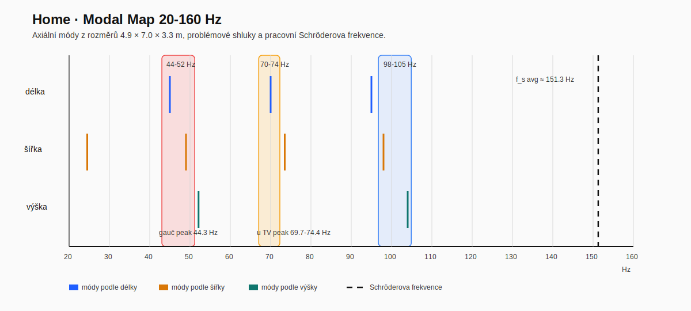
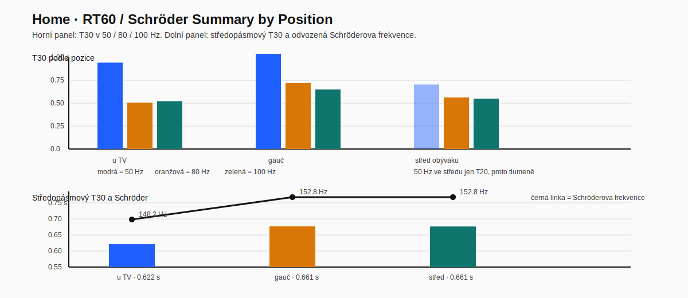

# Aktuální stav 2026-05-16 (Home, BW 685)

Tento souhrn vychází z exportů ve složkách:

- `measurements/SPL Phase phase/`
- `measurements/impulse responses/`
- `measurements/RT60/`
- PNG grafy ve `measurements/`

## 1) Inventář měření

Kompletní sada podle exportů:

- `L uTV_doma_loopback May 16` -> pozice `u TV`
- `R uTV_doma_loopback May 16` -> pozice `u TV`
- `L+R uTV_doma_loopback May 16` -> pozice `u TV`
- `L sedacka_doma_loopback` -> pozice `gauč`
- `R sedacka_doma_loopback May 16` -> pozice `gauč`
- `L+R sedacka_doma_loopback May 16` -> pozice `gauč`
- `L+R stred_obyvaku_doma_loopback May 16` -> pozice `střed obýváku`

Prakticky:
- pro `u TV` a `gauč` existuje oddělené L/R měření i společné `L+R`
- `střed obýváku` je v této sérii jen orientační `L+R` reference, bez diagnostického rozdělení na jednotlivé kanály

## 2) Loopback delay z poznámek v exportu

Pozice `u TV`:
- `L`: 4.5798 ms, cca 1.571 m
- `R`: 6.4464 ms, cca 2.211 m
- `L+R`: 5.0806 ms, cca 1.743 m

Pozice `gauč`:
- `L`: 10.3264 ms, cca 3.542 m
- `R`: 11.6238 ms, cca 3.987 m
- `L+R`: 10.4477 ms, cca 3.584 m

Pozice `střed obýváku`:
- `L+R`: 6.4579 ms, cca 2.215 m

Interpretace:
- pravý kanál vychází v obou měřených poslechových bodech dál než levý
- to odpovídá excentrickému postavení repro a nesymetrické geometrii místnosti
- samotná delay čísla zde slouží hlavně jako konzistentní orientace a kontrola měřicího postupu

## 3) Frekvenční odezva: rychlé praktické shrnutí

Pozice `u TV`:
- `L`: peak 116.84 dB @ 106.8 Hz; průměr 40-80 Hz 107.12 dB; 80-200 Hz 111.09 dB
- `R`: peak 121.03 dB @ 74.4 Hz; průměr 40-80 Hz 113.38 dB; 80-200 Hz 112.65 dB
- `L+R`: peak 122.00 dB @ 69.7 Hz; průměr 40-80 Hz 115.17 dB; 80-200 Hz 114.32 dB

Pozice `gauč`:
- `L`: peak 116.55 dB @ 86.0 Hz; průměr 40-80 Hz 110.60 dB; 80-200 Hz 105.67 dB
- `R`: peak 120.16 dB @ 44.3 Hz; průměr 40-80 Hz 113.56 dB; 80-200 Hz 108.15 dB
- `L+R`: peak 124.08 dB @ 44.3 Hz; průměr 40-80 Hz 114.77 dB; 80-200 Hz 107.50 dB

Pozice `střed obýváku`:
- `L+R`: peak 119.19 dB @ 70.3 Hz; průměr 40-80 Hz 107.46 dB; 80-200 Hz 108.79 dB

Interpretace:
- největší LF buildup je na `gauči`, zejména kolem 44 Hz
- `u TV` má výrazný upper-bass / low-mid tlak kolem 70-110 Hz, ale méně extrémní 44 Hz mód než gauč
- `střed obýváku` má proti gauči menší 40-80 Hz průměr, ale stále zvýraznění kolem cca 70 Hz
- pravý kanál je v obou měřených bodech v basech silnější než levý, což odpovídá nesymetrické instalaci

Poznámka k levelům:
- absolutní SPL hodnoty je potřeba brát relativně, protože gain mikrofonu ani zesilovače nebyly kalibrované na absolutní referenci

## 4) RT60 / decay: co říkají exporty

`L+R u TV`:
- 50 Hz: T30 cca 0.942 s
- 80 Hz: T30 cca 0.506 s
- 100 Hz: T30 cca 0.522 s
- full-band T30 cca 0.525 s

`L+R gauč`:
- 50 Hz: T30 cca 1.037 s
- 80 Hz: T30 cca 0.719 s
- 100 Hz: T30 cca 0.649 s
- full-band T30 cca 0.630 s

`L+R střed obýváku`:
- 50 Hz: T30 pro tento export nevychází spolehlivě, ale T20 je cca 0.703 s
- 80 Hz: T30 cca 0.562 s
- 100 Hz: T30 cca 0.548 s
- full-band T30 cca 0.549 s

Interpretace:
- nejdelší problémový dozvuk v basech je na `gauči`
- `u TV` má také prodloužený 50 Hz decay, ale výrazně kratší než gauč
- `střed obýváku` vychází mezi oběma extrémy, bez tak silného prodloužení jako gauč

## 4.1 RT60, Schröderova frekvence a modalita místnosti

Z nově doplněné výšky stropu `3.3 m` a z `L+R` RT60 exportů pro tři pozice jde dopočítat:

- objem místnosti: cca `113.2 m3` (`4.9 × 7.0 × 3.3 m`)
- obálková plocha ideálního kvádru: cca `147.1 m2`
- středopásmový `T30` průměr z pásem `500-2000 Hz` vychází:
	- `u TV`: cca `0.622 s`
	- `gauč`: cca `0.661 s`
	- `střed obýváku`: cca `0.661 s`
	- průměr přes tyto pozice: cca `0.648 s`
- odpovídající pracovní Schröderova frekvence vychází přibližně:
	- `u TV`: `148.2 Hz`
	- `gauč`: `152.8 Hz`
	- `střed obýváku`: `152.8 Hz`
	- pracovní průměr místnosti: cca `151.3 Hz`

Použité vztahy:

- objem: `V = L × W × H`
- Schröderova frekvence: `f_s ≈ 2000 × sqrt(RT60 / V)`
- ekvivalentní absorpční plocha podle Sabina: `A = 0.161 × V / RT60`
- axiální módy: `f_n = n × c / (2d)`, kde `c ≈ 343 m/s`

Dosazení pro Home:

- `V = 4.9 × 7.0 × 3.3 = 113.19 m3`
- `f_s(avg) ≈ 2000 × sqrt(0.648 / 113.19) = 151.3 Hz`
- `A(avg) = 0.161 × 113.19 / 0.648 = 28.1 sabin`

Praktická interpretace:

- domácí místnost je proti Industře výrazně menší, takže modální oblast sahá mnohem výš
- většina pásma do cca `150 Hz` je ještě významně ovlivněná módy místnosti
- to dobře odpovídá tomu, že největší problémy se koncentrují právě kolem `44-50 Hz` a `70-75 Hz`

## 4.2 Pracovní modal mapa 20-120 Hz

První axiální modal mapa ideálního kvádru:

- délka `4.9 m`: `35.0`, `70.0`, `105.0 Hz`
- šířka `7.0 m`: `24.5`, `49.0`, `73.5`, `98.0 Hz`
- výška `3.3 m`: `52.0`, `103.9 Hz`

Nejdůležitější shluky:

- `44-52 Hz`: velmi dobrý kandidát pro vysvětlení nejsilnějšího problému na gauči kolem `44.3-50 Hz`
- `70.0-73.5 Hz`: dobře sedí na výrazné zvýraznění kolem `69.7-74.4 Hz`
- `98-105 Hz`: další zahuštění modů, které může přidávat upper-bass / low-mid tlak, hlavně `u TV`

Čtení grafu:

- modalita se doma táhne výrazně výš než v Industře, protože místnost je malá a Schröderova frekvence vychází kolem `151 Hz`
- první dva nejdůležitější shluky (`44-52 Hz` a `70-74 Hz`) velmi dobře sedí na skutečně naměřené problémy v `u TV` i na `gauči`

Čtení grafu:

- horní panel srovnává `T30` v `50 / 80 / 100 Hz` mezi pozicemi
- dolní panel ukazuje středopásmový `T30` a z něj odvozenou Schröderovu frekvenci pro jednotlivé body
- `gauč` je nejproblematičtější hlavně v nejnižším basu, ale středopásmový `RT60` je mezi body už relativně podobný; problém tedy není jen globální dozvuk, ale i konkrétní vazba poslechového bodu na módy

Praktický závěr:

- u domácího setupu dává čistě fyzické hledání lepší pozice ještě větší smysl než v hale, protože modalita zasahuje vysoko do běžně hudebně důležitého pásma
- loopback zde zlepšuje jistotu v časové konzistenci měření, ale hlavní problém Home není timing mezi sub/top, nýbrž vazba repro + poslechového bodu na room modes

## 5) PNG grafy: co nově potvrzují

K dispozici jsou:

- waterfall PNG pro `L/R u TV` a `L/R gauč`
- SPL PNG overlaye pro `u TV`, `gauč`, `L+R` pozice a repro zvlášť
- RT60 PNG pro `L/R u TV` a `L/R gauč`

Praktické čtení:

- `u TV` je proti gauči relativně kratší a kontrolovanější v oblasti nejnižšího basu
- `R u TV` drží víc energie v pásmu zhruba 40-80 Hz než `L u TV`, což potvrzuje i SPL export
- gauč má u obou kanálů větší LF akumulaci a delší doznívání než `u TV`
- `R gauč` vypadá jako nejproblematičtější kombinace z hlediska basového buildupu a nerovnoměrnosti
- nové SPL PNG potvrzují, že rozdíl mezi `u TV` a `gauč` není detail, ale systémová změna tvaru odezvy podle pozice
- nové RT60 PNG podporují závěr, že `gauč` má delší a méně čistý LF decay než `u TV`

Co to znamená pro poslech:

- hlavní poslechová pozice na gauči je výrazně víc ovlivněná room modes než pozice `u TV`
- pro kritické porovnávání změn setupu je vhodnější používat `u TV` jako referenční bod a gauč brát jako kontrolní real-world bod

## 6) Co z toho plyne prakticky

- hlavní problém domácího setupu je módová nerovnoměrnost v basech, ne absence energie
- gauč je z pohledu poslechu nejproblematičtější bod kvůli silnému 44-50 Hz buildupu a delšímu decay
- asymetrie L/R je reálná a není vhodné ji skrývat pouze společným `L+R` měřením
- pro další ladění je správný postup dívat se nejdřív na `L` a `R` zvlášť a až potom vyhodnocovat `L+R`

Shrnutí po pozicích:

- `u TV`: technicky čistší a použitelnější referenční bod pro porovnání změn
- `gauč`: nejhorší basová stabilita, silný mód kolem 44-50 Hz, delší decay
- `střed obýváku`: orientační referenční `L+R` varianta mezi oběma extrémy

## 7) Co doplnit příště

Minimum:
- držet stejné PNG overlaye (`All SPL`, `RT60`, waterfall) i pro další varianty postavení
- ETC screenshoty pro `u TV` a `gauč`
- waterfall nebo decay screenshot i pro klíčové `L+R` varianty

Pokud se bude řešit ladění nebo přesun repro:
- zopakovat stejnou sérii po každé změně pozice repro
- porovnávat hlavně 40-80 Hz, 80-200 Hz a decay v 50-100 Hz
- `střed obýváku` držet jako lehkou `L+R` referenci, pokud nebude potřeba hlubší diagnostika

## 8) Pracovní závěr pro další krok

Bez dalšího přesunu repro nebo gauče by první pracovní rozhodnutí mělo být:

1. brát `u TV` jako hlavní referenční měřicí bod
2. gauč používat jako kontrolu, jak moc se změna zhorší nebo zlepší v reálném poslechu
3. neřešit EQ dřív, než se ověří aspoň 1-2 rozumné varianty fyzického postavení repro