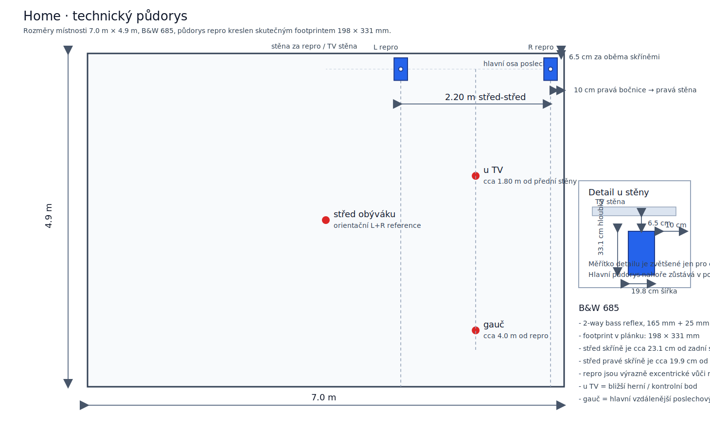
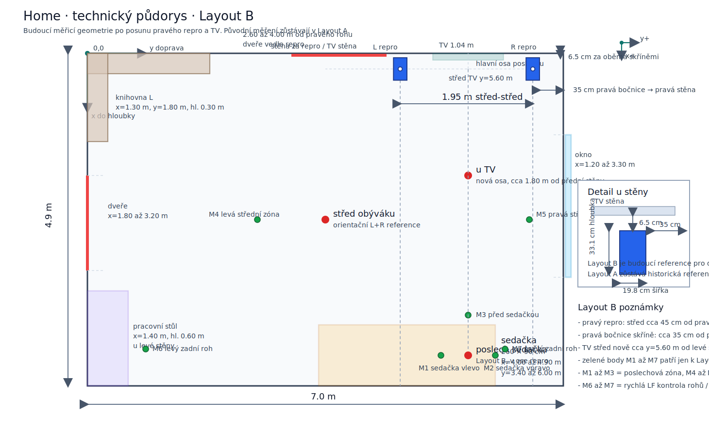

# Místnost a systém (Home)

## 1) Prostor

- Název prostoru: Home
- Typ prostoru: obytná místnost / obývák
- Rozměry půdorysu:
  - délka ve směru vyzařování repro: 4.90 m
  - šířka místnosti: 7.00 m
- Výška místnosti: 3.30 m
- Přibližný objem: cca 113.2 m3

Praktická poznámka:
- repro nejsou v místnosti symetricky, což je důležité pro interpretaci L/R rozdílů v basech i ve středobasu

První akustický odhad z rozměrů:
- axiální módy v pásmu `20-120 Hz` vycházejí zhruba na `24.5`, `35.0`, `49.0`, `52.0`, `70.0`, `73.5`, `98.0`, `103.9` a `105.0 Hz`
- jde o dobrý první rámec pro interpretaci peaků kolem `44-50 Hz` a `70-75 Hz`

## 2) Rozmístění repro

- systém: stereo pár Bowers & Wilkins 685
- typ: 2-way bass reflex compact speaker
- půdorysný footprint jedné bedny: 198 mm (šířka) × 331 mm (hloubka)
- výška středu repro: 1.00 m
- vzdálenost střed-střed: 2.20 m
- vzdálenost zadní stěny repro od zadní stěny místnosti: 0.065 m
- z toho plyne půdorysný střed skříně cca 0.231 m od zadní stěny místnosti

Boční umístění:
- pravá bočnice pravého repro: 0.10 m od boční stěny místnosti
- střed pravého repro: cca 0.199 m od pravé boční stěny místnosti
- střed levého repro: cca 4.60 m od levé boční stěny místnosti
- levá bočnice levého repro: cca 4.50 m od levé boční stěny místnosti

Praktický dopad:
- velmi malá vzdálenost zadní stěny repro od zadní stěny místnosti i malá mezera pravého repro od boční stěny zvyšují pravděpodobnost silné boundary gain podpory a L/R asymetrie
- pravý a levý kanál tak pracují v jiné vazbě na stěny, takže je očekávatelná L/R asymetrie v odezvě i v decay

Varianty layoutu pro tento projekt:
- `Home-A` = původní změřená geometrie ze série `2026-05-16`; právě tato varianta odpovídá všem dosavadním publikovaným měřením
- `Home-B` = nová budoucí geometrie po prvních mechanických změnách; zatím ještě bez nové měřicí série
- každé další měření je vhodné svázat nejen s bodem, ale i s layoutem, například `HA_uTV`, `HA_gauc`, `HB_M1`, `HB_M4`

Pracovní souřadnicový systém pro další Home měření:
- počátek `0,0,0` = levý přední roh místnosti při pohledu od repro do místnosti, na podlaze
- osa `x` = od přední stěny se repro do hloubky místnosti
- osa `y` = od levé stěny doprava
- osa `z` = výška nad podlahou

Pevné reference v tomto systému:
- střed levého repro: přibližně `x=0.231 m`, `y=4.600 m`, `z=1.000 m`
- střed pravého repro: přibližně `x=0.231 m`, `y=6.801 m`, `z=1.000 m`
- okno na pravé stěně: `y=7.000 m`, rozsah přibližně `x=1.20 až 3.30 m`
- střed TV na přední stěně: `x=0.000 m`, `y=5.450 m`; při šířce `1.04 m` vychází TV přibližně v rozsahu `y=4.93 až 5.97 m`
- sedačka: šířka `2.60 m`, hloubka `0.90 m`, přiražená ke stěně proti repro a současně `1.00 m` od pravé stěny s oknem; půdorysově tedy zhruba `x=4.00 až 4.90 m`, `y=3.40 až 6.00 m`
- geometrický střed sedačky: přibližně `x=4.45 m`, `y=4.70 m`

Praktická naming konvence:
- měřicí body zapisovat jako `nazev_x.._y.._z..`, například `gauc_stred_x4.45_y4.70_z1.00`
- pokud je bod vázaný na objekt, držet i referenci objektu, například `tv_stred`, `gauc_stred`, `osa_repro`

Home-B: nová budoucí geometrie po první mechanické změně:
- levý repro zatím beze změny: přibližně `x=0.231 m`, `y=4.600 m`, `z=1.000 m`
- pravý repro po odsazení od pravé stěny: přibližně `x=0.231 m`, `y=6.551 m`, `z=1.000 m`
- pravá bočnice pravého repro je nově přibližně `0.35 m` od pravé stěny
- rozteč střed-střed tím vychází přibližně `1.95 m`
- střed TV je pro budoucí měření nově přibližně `x=0.000 m`, `y=5.600 m`

Navržené budoucí měřicí body pro `Home-B`:
- `HB_M1`: sedačka vlevo, orientačně `x=4.45 m`, `y=5.20 m`, `z=1.00 m`
- `HB_M2`: sedačka vpravo, orientačně `x=4.45 m`, `y=5.80 m`, `z=1.00 m`
- `HB_M3`: před sedačkou v ose, orientačně `x=3.86 m`, `y=5.60 m`, `z=1.00 m`
- `HB_M4`: levá střední zóna místnosti, orientačně `x=2.45 m`, `y=2.50 m`, `z=1.00 m`
- `HB_M5`: pravá střední zóna místnosti, orientačně `x=2.45 m`, `y=6.50 m`, `z=1.00 m`
- `HB_M6`: levý zadní LF kontrolní bod, orientačně `x=4.36 m`, `y=0.86 m`, `z=1.00 m`
- `HB_M7`: pravý zadní LF kontrolní bod, orientačně `x=4.36 m`, `y=6.14 m`, `z=1.00 m`

Praktický význam těchto bodů:
- `M1-M3` jsou vhodné pro poslechovou zónu a lokální stabilitu stereo / tonal balance
- `M4-M5` lépe ukážou laterální asymetrii a změny room response ve střední části místnosti
- `M6-M7` slouží hlavně jako rychlá kontrola LF modálního pole a decay pod Schröderovou oblastí

## 3) Technické specs modelu

- výrobce: Bowers & Wilkins
- model: 685
- roky výroby: 2007-2014
- ozvučnice: 2-way, 2 driver, bass reflex
- woofer / midbass: 1× 165 mm Kevlar cone
- tweeter: 1× 25 mm aluminium dome
- doporučený výkon zesilovače: 25-100 W
- citlivost: 88 dB (2.83 V / 1 m)
- impedance: 8 ohm, minimum cca 3.7 ohm
- dělící frekvence: 4 kHz
- rozměry jedné bedny: 340 × 198 × 331 mm (V × Š × H)
- hmotnost jedné bedny: cca 7 kg

Poznámka k publikovaným frekvenčním údajům:
- v dostupných podkladech se objevují dvě různé formulace: `49-22 000 Hz (±3 dB)` a širší katalogové `42 Hz-50 kHz`
- pro tuto dokumentaci je důležitější reálné in-room měření než samotný katalogový rozsah

Rozšířený technický profil z externích review:
- AudioExcite parts 1-4 a navazující ASR thread se shodují, že samotné drivery jsou na třídu velmi slušné, ale slabší místo je původní výhybka a integrace obou měničů
- kabinet podle AudioExcite: `15 mm MDF`, `22 mm` čelní stěna, jedna vnitřní svislá výztuha, přední `Flowport`, lehké tlumení, čistý objem cca `15.3 l`
- tweeter `HF00655`: `25 mm` aluminium dome s rear chamber ve stylu `Nautilus`, nízké zkreslení, break-up až kolem `31 kHz`
- midwoofer `LF011589`: `6.5"` kevlar s reálným phase plugem, dobrá linearita a nízké liché zkreslení, jen lehká anomálie kolem `0.8-1 kHz`
- z průměrovaných T/S dat v AudioExcite: tweeter přibližně `Re 3.0 ohm`, `fs 790 Hz`, `Qts 0.65`; woofer přibližně `Re 3.9 ohm`, `fs 50.1 Hz`, `Qts 0.37`, `Vas 17.8 l`, `92.6 dB / 2.83 V / 1 m`
- systémové měření v review: port tuning cca `48 Hz`, impedance minima cca `4.79 ohm @ 197 Hz` a `3.59 ohm @ 20 kHz`, tedy prakticky spíš lehčí `4ohm` zátěž než skutečných `8 ohm`
- hlavní systémový problém podle review: kolem `4 kHz` je cca `+5 dB` zdvih v oblasti crossoveru, tweeter je zvýrazněný nad `10 kHz` a směrovost / phase tracking nejsou ideálně sladěné

Praktická interpretace pro tento projekt:
- externí review a domácí REW data si přímo neodporují, protože řeší jinou věc
- review se dívají hlavně na samotnou bednu a její crossover / directivity chování
- zdejší měření popisují hlavně interakci bedny s místností, zejména v pásmu `40-80 Hz`
- pracovní závěr je tedy dvojí: doma je největší problém room response v basech, ale bedna samotná může zároveň přispívat lehce jasnějším nebo méně soudržným horním pásmem

Vhodnost navrhovaných modifikací výhybky pro tento setup:
- jednoduchý `Mod 0` z AudioExcite, tedy lehké utlumení tweeteru odporem, může být smysluplný jako levný a reverzibilní test, pokud by subjektivně vadila přehnaná energie výšek
- hlubší přestavby výhybky `Mod 1 / 1.5 / 2` mohou zlepšit tonální rovnost a soudržnost, ale nevyřeší současný hlavní problém tohoto setupu: room modes, decay a L/R asymetrii
- proto je pro tento projekt rozumnější pořadí: nejdřív geometrie a postavení, teprve potom případný crossover mod

Zdroje k externím review:
- AudioExcite part 1: <https://www.audioexcite.com/?page_id=6070>
- AudioExcite part 2: <https://www.audioexcite.com/?page_id=6086>
- AudioExcite part 3: <https://www.audioexcite.com/?page_id=6164>
- AudioExcite part 4: <https://www.audioexcite.com/?page_id=6225>
- ASR thread: <https://www.audiosciencereview.com/forum/index.php?threads/an-attemp-to-make-subjective-and-objective-analysis-of-bowers-wilkins-685-s1-bookshelf-speakers.44272/>

## 4) Měřicí pozice

Společné:
- výška mikrofonu ve všech pozicích: 1.00 m

Pozice:
- `HA_uTV`: bližší pozice u televize, kde se hrají hry s gamepadem; cca 1.80 m od stěny, na které jsou repro; přibližně v ose repro layoutu `Home-A`
- `HA_gauc`: hlavní reálná poslechová pozice ve staré sérii `Home-A`
- `HA_stred_obyvaku`: geometrický střed místnosti v původní sérii
- `HB_M1` až `HB_M7`: zatím jen definované body pro budoucí měření layoutu `Home-B`

## 5) Zvukový řetězec a režim měření

- software: REW
- zvukovka / interface: Scarlett 2i2 4th Gen
- mikrofon: t.bone MM-1
- kalibrace mikrofonu: frekvenční charakteristika odečtena v REW, stejně jako u měření Industra
- zesilovač: Denon PMA-495R
- stav zesilovače: modifikovaný / recapped by CASEA, protokol datovaný `1.4.2025`
- pro měřicí řetězec jsou nejdůležitější tyto úpravy zesilovače:
  - hlavní filtrace `2× EPCOS 10 000 uF / 63 V`
  - `HEXFRED` diody v hlavním napájecím zdroji
  - nové lokální zdroje a vyčištěné / opravené přepínače a relay
- phono a korekční op-ampy byly také měněné, ale při tomto měření je zesilovač používaný v line větvi a v režimu `source direct`
- `source direct` zde obchází `balance`, `bass`, `treble` a `loudness`, takže korekční větev není pro tohle měření v aktivní signálové cestě
- sample rate: 48 kHz
- sweep: 256k log sweep, 2 opakování
- sweep level: -12.2 dBFS
- EQ / tone controls: bez EQ, zesilovač v režimu `source direct`

Gain staging:
- gain mikrofonu a hlasitost zesilovače nebyly kalibrovány na absolutní SPL
- praktické pravidlo bylo: dostatečně hlasitě, ale bez clippingu

To znamená:
- měření jsou vhodná hlavně pro vzájemné porovnání tvaru křivek, decay a L/R rozdílů
- absolutní SPL čísla nebrat jako přesně kalibrovaný referenční level prostoru

## 6) Loopback metoda

Jednotlivé kanály:
- při `L` měření jde výstup L do zesilovače a reference se vrací přes `tape out` do vstupu 2 zvukovky
- při `R` měření stejná logika pro pravý kanál

Současné `L+R` měření:
- protože zvukovka nemá třetí dedikovaný referenční výstup, timing reference je při `L+R` vázaná na jeden kanál

Praktický závěr:
- pro domácí stereo room response je tento postup použitelný
- pro přesné inter-channel timing rozhodování mezi L a R to není ideální laboratorní metoda
- pro tento projekt je důležitější konzistence postupu než absolutní přesnost mezi kanály

## 7) Co je už změřeno

Z exportů jsou aktuálně k dispozici:

- `u TV`: `L`, `R`, `L+R`
- `gauč`: `L`, `R`, `L+R`
- `střed obýváku`: `L+R`

Tyto exporty patří do layoutu `Home-A`.

Pro layout `Home-B` zatím ještě není nová kompletní série změřená.

Exportované datové sady:
- `SPL Phase phase/`
- `impulse responses/`
- `RT60/`
- waterfall PNG pro jednotlivé kanály
- SPL PNG overlaye pro `u TV`, `gauč` a přehled `L+R`
- RT60 PNG pro `u TV` a `gauč`

Poznámka:
- `střed obýváku` je v této sérii jen orientační referenční `L+R` bod, ne plná diagnostická pozice s odděleným `L` a `R`

## 8) Ilustrace postavení

Historický změřený layout `Home-A`:

Budoucí měřicí layout `Home-B`:

