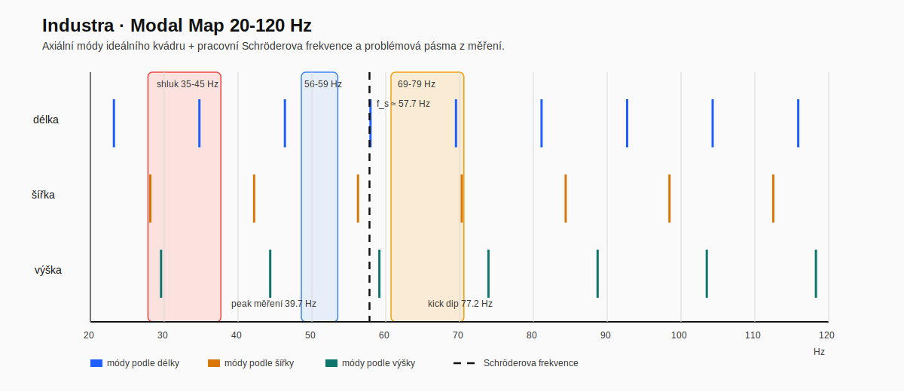
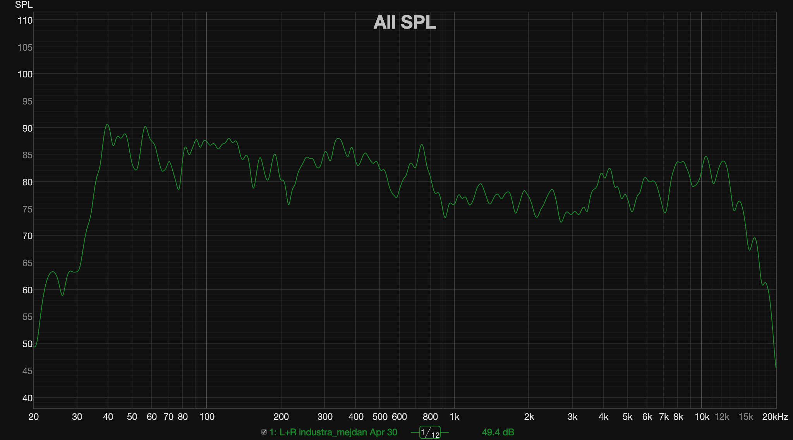
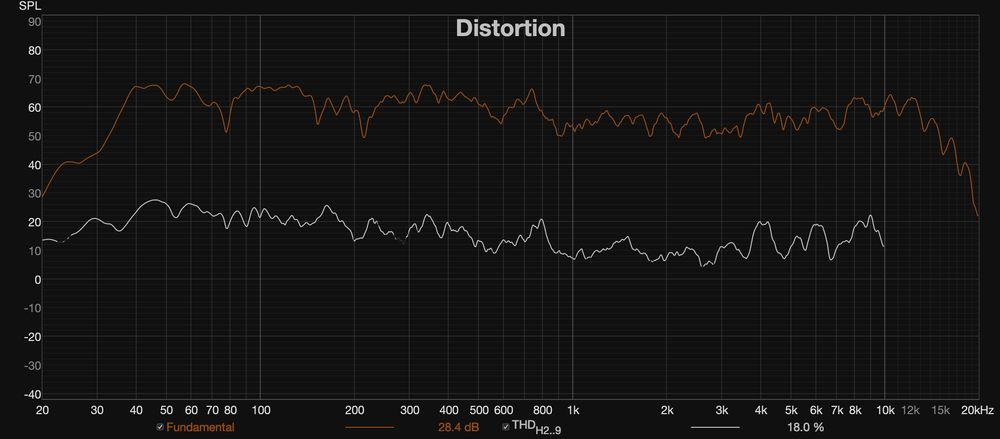
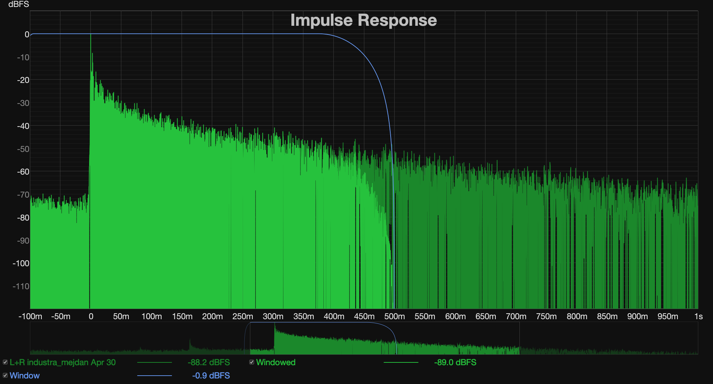
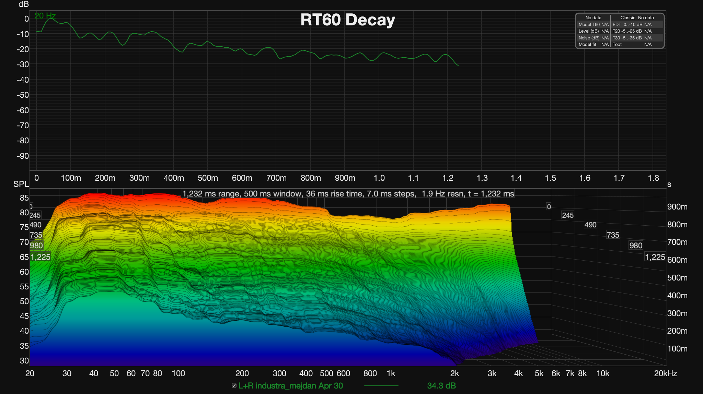
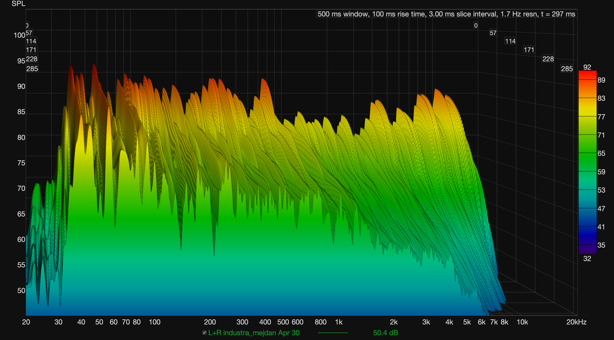

# Aktuální stav 2026-04-30 (Industra, JBL)

## 1) Z jakých dat vychází tento report

Zdroj je pouze z měřicí složky:

- `measurements/2026-04-30_jbl-mejdan/text_export/`
- `measurements/2026-04-30_jbl-mejdan/graphs_export/`

Měření: `L+R industra_mejdan Apr 30` (2x EON715 + 2x PRX818XLF), sweep bez timing reference.

## 2) Aktuální stav systému podle dat

- Výrazný peak v subbasu: **90.61 dB @ 39.71 Hz** (pásmo 35-45 Hz).
- Oslabení v oblasti punch/kick: **78.52 dB @ 77.16 Hz** (v pásmu 70-100 Hz).
- Průměr pásma 70-90 Hz: **83.41 dB**.
- Průměr pásma 90-120 Hz: **86.95 dB**.
- Rozdíl průměrů 90-120 vs 70-90 Hz: přibližně **+3.54 dB**.
- T30 (RT60 proxy) je dlouhé hlavně dole:
  - 50-125 Hz: **2.09 s**
  - 160-1000 Hz: **1.85 s**
  - 1250-10000 Hz: **1.08 s**

Interpretace: prostor stále přidává „dunění“ pod 50 Hz a současně maskuje čitelnost kopáku v 70-100 Hz.

## 2.1 RT60 a Schröderova frekvence: co jde dopočítat už teď

Z jednoho exportu `rt60.txt` a známých rozměrů místnosti lze vytáhnout ještě tyto pracovní závěry:

- objem místnosti: cca `2094 m3` (`14.8 × 12.2 × 11.6 m`)
- obálková plocha ideálního kvádru: cca `987.5 m2`
- středopásmový `T30` průměr z pásem `500-2000 Hz`: cca `1.75 s`
- z toho vychází pracovní Schröderova frekvence `f_s ≈ 57.7 Hz` podle vztahu `f_s ≈ 2000 × sqrt(RT60 / V)`
- ekvivalentní absorpční plocha podle Sabina vychází přibližně `193 sabin`
- z toho by odpovídal průměrný součinitel pohltivosti obálky jen cca `0.20`

Použité vztahy:

- objem: `V = L × W × H`
- Schröderova frekvence: `f_s ≈ 2000 × sqrt(RT60 / V)`
- ekvivalentní absorpční plocha podle Sabina: `A = 0.161 × V / RT60`
- axiální módy: `f_n = n × c / (2d)`, kde `c ≈ 343 m/s`

Dosazení pro tento pracovní odhad:

- `V = 14.8 × 12.2 × 11.6 = 2094.5 m3`
- `f_s ≈ 2000 × sqrt(1.746 / 2094.5) = 57.7 Hz`
- `A = 0.161 × 2094.5 / 1.746 = 193.1 sabin`

Praktická interpretace:

- pod cca `58 Hz` se prostor chová převážně modálně
- pásmo cca `60-120 Hz` je přechodové: room mode chování ještě nezmizelo, ale už se do něj víc promítá směrovost, geometrie a interference systému
- nad cca `120 Hz` už je větší část problému spíš kombinace odrazů, dozvuku a lokálních interferencí než čistě diskrétních módů

To podporuje i naměřený průběh:

- peak kolem `39.7 Hz` sedí přesně do modální oblasti pod Schröderem
- oslabení kolem `70-80 Hz` už velmi pravděpodobně není jen jeden čistý mód, ale směs místnosti + sub/top interference + geometrie postavení

Korekce k ideálnímu modelu:

- za DJem je patro z kovové konstrukce, takže zadní část prostoru není akusticky čistý kvádr
- kvádrový výpočet je i tak dobrý první odhad pro nízkofrekvenční řády celé haly, ale lokální rozložení tlakových maxim a odrazů bude tím patrem narušené

## 2.2 První axiální módy ideálního kvádru

Jako první odhad podle rozměrů haly vycházejí tyto axiální frekvence:

- délka `14.8 m`: `11.6 Hz`, `23.2 Hz`, `34.8 Hz`, `46.4 Hz`
- šířka `12.2 m`: `14.1 Hz`, `28.1 Hz`, `42.2 Hz`, `56.2 Hz`
- výška `11.6 m`: `14.8 Hz`, `29.6 Hz`, `44.4 Hz`, `59.1 Hz`

Praktický význam:

- v pásmu `35-45 Hz` se začíná potkávat několik nízkých řádů najednou
- to dobře sedí s reálně naměřeným subbasovým peákem okolo `40 Hz`
- okolí `56-59 Hz` vychází velmi blízko odhadované Schröderově frekvenci, takže právě tam už se potkává modální a přechodové chování prostoru

## 2.3 Pracovní modal mapa 20-120 Hz

V pásmu `20-120 Hz` vychází z axiálních módů tento pracovní přehled:

- délka `14.8 m`: `23.2`, `34.8`, `46.4`, `57.9`, `69.5`, `81.1`, `92.7`, `104.3`, `115.9 Hz`
- šířka `12.2 m`: `28.1`, `42.2`, `56.2`, `70.3`, `84.3`, `98.4`, `112.5 Hz`
- výška `11.6 m`: `29.6`, `44.4`, `59.1`, `73.9`, `88.7`, `103.5`, `118.3 Hz`

Nejdůležitější shluky v pásmu:

- `34.8-44.4 Hz`: silný kandidát na vysvětlení peaku kolem `39.7 Hz`
- `56.2-59.1 Hz`: přechod od čistě modálního pásma směrem ke Schröderově frekvenci
- `69.5-73.9 Hz`: pásmo, kde se může kombinovat módové chování s interferencí sub/top a s oslabením punch oblasti
- `84-89 Hz` a `98-104 Hz`: další zahuštění módů už v přechodovém pásmu, které může komplikovat stabilitu crossover oblasti mezi body

Čtení grafu:

- svislé čáry jsou jednotlivé axiální módy podle délky, šířky a výšky
- přerušovaná čára je pracovní Schröderova frekvence
- barevná pásma ukazují nejdůležitější shluky, které se potkávají s naměřeným peakem kolem `40 Hz` a s problematickým pásmem `70-80 Hz`

## 2.4 Timing a fáze: co už teď víme

- Propad kolem 70-80 Hz může být kombinace room módu a sub/top interference.
- Vzhledem k tomu, že měření je bez timing reference, nelze potvrdit přesný časový offset sub vs top.
- Timing je ale pravděpodobně významný faktor: pásmo kolem crossoveru (cca 70-100 Hz) je přesně tam, kde se nejčastěji projeví špatné časové zarovnání.

Praktický závěr pro tento stav:
- Timing je potřeba brát jako klíčovou hypotézu, ale definitivně ho ověřit až v příští sérii měření s referencí.

## 2.5 Co z postavení a místnosti pravděpodobně kazí výsledek

- Rozměry haly (14.8 x 12.2 x 11.6 m) podporují silné nízkofrekvenční módy; to odpovídá peaku 35-45 Hz i slabší čitelnosti kolem 70-80 Hz.
- Suby jsou o 0.5 m před topy, což vytváří přirozený časový offset mezi pásmy ještě před DSP korekcí.
- Výškový rozdíl center top/sub je 1.45 m, takže v crossover pásmu vzniká výrazná geometrická interference podle místa poslechu.
- Měření v 0.8 m výšce a relativně blízko PA (cca 2.5 m) zvýrazňuje lokální interferenci; pro rozhodnutí je potřeba více pozic a i výška blíže uším publika.
- Natočení cca 45° a velký otevřený prostor mohou dávat asymetrické boční odrazy a nerovnoměrné pokrytí.

Praktický dopad:
- Problém není jen EQ, ale kombinace room mode + geometrie + timing.
- Samotný PEQ bez ověřeného postavení a timingu bude nestabilní mezi body v prostoru.

## 2.6 Jak moc je RT60 z jednoho měření použitelná

Ano, i z tohoto jednoho měření jde RT60 rozšířit o rozumnou interpretaci, ale jen s jasnými limity:

- pro hrubý trend podle frekvence je to použitelné
- pro výpočet Schröderovy frekvence je to použitelné jako pracovní odhad
- pro definitivní popis celé haly to nestačí, protože jde jen o jeden bod `M1` a jeden konkrétní setup PA
- nízkofrekvenční `RT60` v takto velkém prostoru je navíc citlivé na polohu zdroje, mikrofonu, SNR a na to, jak moc systém budí konkrétní módy

Co už se dá tvrdit s rozumnou jistotou:

- hala má dlouhý dozvuk v basech a spodních středech
- modální oblast sahá zhruba do pásma kolem `60 Hz`
- peak kolem `40 Hz` je konzistentní s rozměry prostoru

Co z jednoho měření naopak ještě nelze tvrdit dost jistě:

- reprezentativní `RT60` celé haly pro normované posouzení prostoru
- přesnou mapu problémových módů v publiku
- jak se decay mění napříč dancefloorem a mimo osu PA

## 2.7 TODO pro další sérii

- doplnit minimálně `2-3` další měřicí pozice v publiku
- doplnit oddělené série `SUB_ONLY`, `TOP_ONLY`, ideálně i `SUB_LEFT`, `SUB_RIGHT`, `TOP_LEFT`, `TOP_RIGHT`
- zopakovat RT60 / decay interpretaci po těchto měřeních a ověřit, jak moc je výsledek stabilní napříč prostorem

## 3) Grafy s komentářem

### SPL + fáze

Komentář:
- SPL potvrzuje dominantní nárůst kolem 40 Hz.
- V okolí 75-80 Hz je propad, který je kritický pro punch.
- Fáze je použitelná jen orientačně (měření je bez timing reference).

### Distortion

Komentář:
- Pod 30 Hz je THD velmi vysoké, ale to je mimo hlavní hudební pracovní pásmo setupu.
- V pásmu cca 35-140 Hz je THD převážně nízké až střední, takže hlavní problém je spíš room response než nelinearita měničů.

### Impulse

Komentář:
- Impuls potvrzuje, že systém i místnost mají delší dozvukovou složku.
- Bez timing reference nelze z impulsu bezpečně odvodit finální absolutní delay sub vs top.

### Decay

Komentář:
- Delší decay v nízkých pásmech odpovídá subjektivnímu „huhňání“.
- Potvrzuje nutnost opatrných zásahů v 35-50 Hz a lepšího odděleného měření sub/top.

### Waterfall

Komentář:
- Waterfall ukazuje dlouhé doznívání v basech.
- Při ladění je důležité sledovat nejen SPL, ale i zkrácení doznívání v problémových pásmech.

## 4) Co příště jinak (jen outline)

- Měřit povinně odděleně: `SUB_ONLY_LR`, `TOP_ONLY_LR`, `FULL_LR`.
- Ideálně doplnit `SUB_LEFT`, `SUB_RIGHT`, `TOP_LEFT`, `TOP_RIGHT`.
- Použít timing reference (nebo konzistentní gated postup) pro smysluplné fázové/delay rozhodnutí.
- Udržet stejné gain staging a stejné pozice mikrofonu pro A/B.
- Rozhodovat podle průměru více pozic, ne podle jedné křivky.

### 4.1 Doporučení pro jiné postavení při příštím měření

Testovat minimálně dvě varianty postavení ještě před finálním timing laděním:

- Varianta A (stávající): suby předsazené o 0.5 m před topy.
- Varianta B (snazší alignment): topy níž a zarovnané v hloubce se suby (co nejmenší předozadní offset center).

Pro každou variantu udělat krátké porovnání:

1. `SUB_ONLY_LR`
2. `TOP_ONLY_LR`
3. `FULL_LR_base` (normal, 0.0 ms)

Pak pokračovat s timing maticí jen u lepší varianty postavení.

Poznámka k tvému návrhu:
- Snížit topy a zarovnat je se suby je validní a často prakticky jednodušší než řešit velký geometrický offset jen delayem.