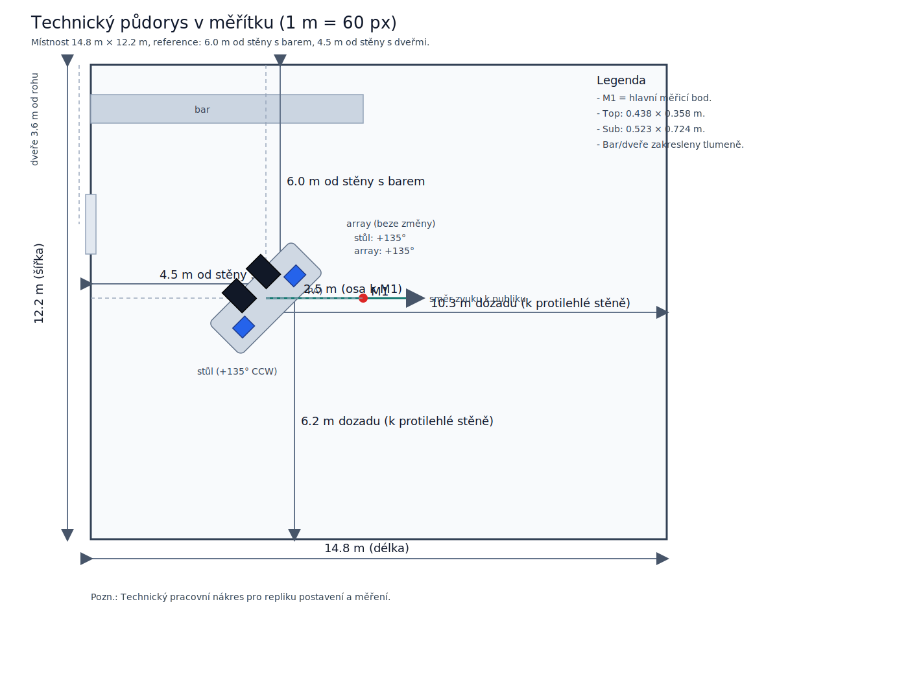
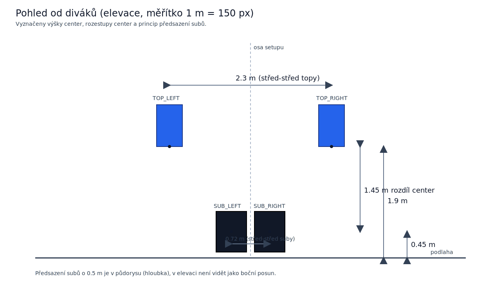

# Místnost a systém (minimální systematický popis)

Tento dokument je šablona pro konzistentní záznam. Vyplňovat při každé akci stejným způsobem.

## 1) Místnost

- Název prostoru: Industra
- Rozměry (d × š × v): 14.8 m × 12.2 m × 11.6 m
- Přibližný objem: cca 2094 m3
- Důležitá stavební poznámka: za DJem je patro z kovové konstrukce
- Typ prostoru: velká hala, otevřený charakter
- Povrchy: převážně tvrdé (upřesnit při dalším měření)
- Kritické odrazy: velké stěny a vysoký strop
- Publiková zóna: před směrováním PA (dancefloor)

Poznámka k modelu místnosti:
- výpočty módů a Schröderovy frekvence níže berou halu jako první přiblížení ideálním kvádrem
- patro z kovové konstrukce za DJem ten model lokálně narušuje, hlavně v zadní části prostoru a v rozložení odrazů
- čísla proto brát jako užitečný první odhad, ne jako přesný normový model celé haly

Souřadný systém pro záznam:
- Osa X: hloubka od stěny s barem (14.8 m)
- Osa Y: šířka od stěny s dveřmi (12.2 m)

## 2) Rozmístění repro

- Společná pozice PA vůči stěnám (čelo repro):
	- 6.0 m od stěny s barem
	- 4.5 m od stěny s dveřmi
	- za PA je více prostoru než před PA
- Natočení PA / podium osa: cca 135° proti směru hodinových ručiček
- Vzdálenost repro -> roh místnosti: cca 8 m

- Prostor za DJ/PA (dozadu):
	- 8.8 m k protilehlé stěně vůči baru
	- 7.7 m k protilehlé stěně vůči dveřím

- TOP_LEFT / TOP_RIGHT:
	- vzdálenost střed-střed: 2.3 m
	- výška středu reproduktoru: 1.9 m nad zemí

- SUB_LEFT / SUB_RIGHT:
	- vzdálenost střed-střed: 0.72 m
	- výška středu reproduktoru: 0.45 m nad zemí
	- suby jsou předsunuté o 0.5 m před topy (směrem k publiku)

- Doplňkové naměřené vzdálenosti středů:
	- TOP_LEFT <-> SUB_LEFT: 2.1 m
	- SUB_LEFT <-> TOP_RIGHT: 2.6 m

- Vztah středu basu vůči středu výšky (na stejné straně):
	- výškový rozdíl středů: 1.45 m (1.90 - 0.45)
	- hloubkový offset: sub je o 0.5 m blíž k publiku

Pracovní instalační poznámka pro další měření:
- jako alternativní výchozí varianta dává smysl testovat suby bez předsazení, topy co nejblíž nad suby a topy zhruba do výšky uší hlavní zóny
- cílem této varianty je zmenšit geometrický offset center ještě před DSP delayem

## 3) Signálový řetězec a DSP

- Zvukovka / interface: Scarlett 2i2 4th Gen
- Routing: topy napájené přes sub out
- Crossover: HPF 80 Hz, Digital 24 dB/oct, Linkwitz-Riley
- Polarity: nezměněna (normal)
- Delay: základní stav, bez finálního alignmentu
- EQ: bez finální korekce (pracovní stav)
- Ochrany / limiter: dle interního DSP beden

## 4) Gain staging (fixní pro měřicí sérii)

- TOP_LEFT gain: 0 dB (max dle stupnice bedny)
- TOP_RIGHT gain: 0 dB (max dle stupnice bedny)
- SUB_LEFT gain: cca 2/3 ("na trojce")
- SUB_RIGHT gain: cca 2/3 ("na trojce")
- Master / controller úroveň: držet fixně v rámci celé série

Pravidlo:
- Během jedné timing série se gainy nemění.

## 5) Mikrofon a měřicí body

M1 je hlavní měřicí bod mikrofonu (ne pozice lidí v prostoru).

- Mikrofon: t.bone MM-1
- Kalibrace: frekvenční charakteristika už odečtena v REW (data jsou po korekci mikrofonu)
- Výška mikrofonu: 0.8 m
- Pozice M1 (hlavní): v čelní ose PA, vzdálenost cca 2.5 m od repro

Referenční souřadnice bodu:
- M1 = [0.0, 0.0] m

## 6) Měřicí režim

- Timing reference: v předchozím měření bez reference; příště povinně loopback
- Sweep level: v předchozím měření nezapsán; jisté je pouze, že nebyl clipping/limiter
- Délka sweepu: v předchozím měření nezapsána
- Pro příště zapisovat povinně: sweep level (dBFS), délku sweepu a potvrzení "bez clippingu/bez limiteru"
- Smoothing: 1/12 nebo 1/24
- Exporty: SPL+Phase, Impulse, RT60, Decay, Waterfall, Distortion, mdat

## 7) Rychlé závěry po měření

- Hlavní problém pásma:
- Nejlepší timing varianta:
- Poznámka k poměru sub/top:
- Co ověřit příště:

Pravidlo interpretace:
- správný timing do hlavního bodu ještě automaticky neznamená nejlepší summation kicku
- po delay kroku je potřeba dál testovat i polaritu (`normal` / `invert`) a hodnotit reálné sčítání v pásmu crossoveru

## 8) Ilustrace postavení

